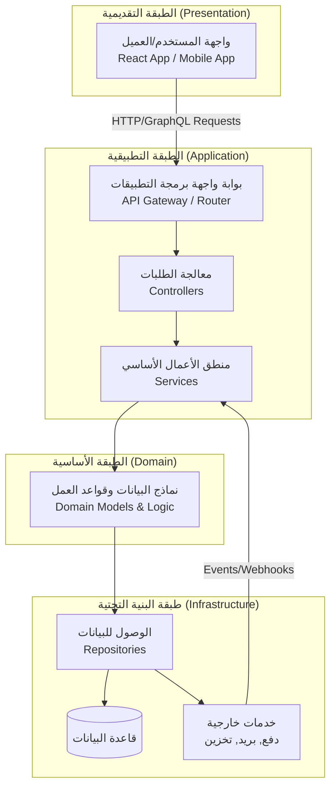
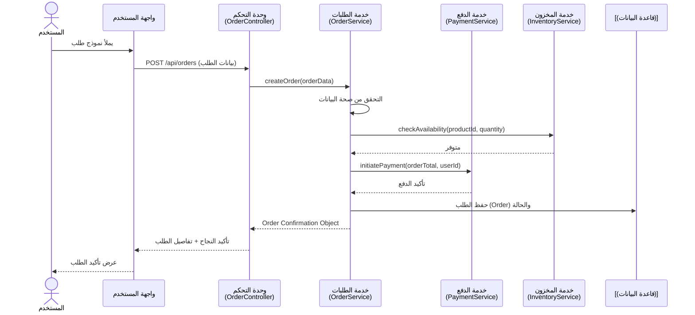

# Project Blueprint
*المصدر الرئيسي لسياق المشروع وتوجيه مساعد الذكاء الاصطناعي (AI Agent).* 

## 🎯 الغرض من هذا الملف

هذا الملف هو **دليل السياق الرئيسي** للمشروع. تم تصميمه خصيصًا لتحقيق هدفين:
## Runtime Update (2025-12-24)

- **Environment snapshot**: The runtime Python environment was reproduced and frozen on 2025-12-24. See `requirements.freeze.txt` at the repository root for exact package versions used during validation (includes `fastapi`, `pydantic==2.12.5`, `langchain`, `chromadb`, etc.).
- **ADR**: The project standardizes on **FastAPI** as documented in `mithaly_blueprint/02_decisions/0003-fastapi-standard.md`.
- **Service verification**: A smoke deployment was run under `mithaly_management` using Uvicorn on port `8001` and the following endpoints were validated: `/healthz` and `/api/v1/agents/run` (see API spec below).

## Agents API — Contract (current)

This section documents the currently deployed contract for invoking agent missions via HTTP.

- **Endpoint**: `POST /api/v1/agents/run`
- **Content-Type**: `application/json`
- **Request schema (accepted forms)**:
    - `input`: Optional. Can be a string or an object. If a string, it is interpreted as the `project` name. If an object, the `project` should be provided via the `project` or `project_name` key.
    - `project_input`: Optional. Legacy field accepted for backward compatibility; treated like `input` when present.
    - `goal`: Required. A short string describing the mission goal.

    Example variants (all accepted):

    - Simple string input:

        `{"input": "hello_world", "goal": "Run smoke mission"}`

    - Structured input:

        `{"input": {"project": "hello_world", "meta": {"owner":"team"}}, "goal": "Run smoke mission"}`

    - Legacy payload:

        `{"project_input": "hello_world", "goal": "Run smoke mission"}`

- **Behavior**: The API normalizes the request to determine the `project_name` and then calls the local mission runner: `python3 run_mission.py --input INPUT/{project_name} --goal "{goal}"`. The service returns the mission stdout/stderr and status as JSON.

- **Response (successful run)**: JSON object including `success: true` and the mission `stdout` which contains mission phases and final `status` (e.g., `"SUCCESS"`).

## Notes & Next Steps

- Update `PROJECT_BLUEPRINT.md` if the agents API or runner arguments change.
- Add an automated CI smoke test that starts the `mithaly_management` FastAPI server and POSTs the three request variants to `/api/v1/agents/run` to detect contract drift.
- Consider introducing explicit OpenAPI request models in `mithaly_management/app/api/v1/endpoints/agents.py` so generated docs reflect both legacy and new input forms.


1.  **للمطورين والبشر**: تقديم نظرة هندسية شاملة عن النظام في مكان واحد.
2.  **لمساعد الذكاء الاصطناعي (AI Agent)**: توفير السياق اللازم لفهم المشروع بشكل عميق، مما يمكنه من تقديم اقتراحات ومساهمات دقيقة ومفيدة، بدلاً من الاضطرار إلى استنتاج المعلومات من الكود والتوثيق المتناثر.

فكر فيه كـ **"عقل المشروع الخارجي"** أو **"ذاكرة المشروع الجماعية"** التي يستطيع الجميع، بما في ذلك الذكاء الاصطناعي، الرجوع إليها لفهم الصورة الكبيرة والدقيقة.

## 🏗️ 1. الهيكل العام والبنية (High-Level Design)

### 1.1. نظرة عامة على النظام
*   **النوع**: تطبيق ويب (Web App) / خدمة واجهة برمجة تطبيقات (API Service) / مكتبة (Library) / أخرى.
*   **الهدف الأساسي**: [اشرح بشكل موجز المشكلة التي يحلها هذا النظام، مثال: "منصة لإدارة المشاريع والتعاون بين الفرق."]
*   **التقنيات الأساسية (Tech Stack)**:
    *   **Backend**: [Node.js with Express / Python with Django / Java with Spring Boot / ...].
    *   **Frontend**: [React / Vue.js / Angular / ...].
    *   **قاعدة البيانات**: [PostgreSQL / MongoDB / MySQL / ...].
    *   **البنية**: [Monolith / Microservices / Serverless / ...].

### 1.2. هيكل الملفات والدلائل (الهيكل المنطقي)
يمثل الهيكل التالي التنظيم المنطقي للمشروع وكيفية تفاعل أجزائه الرئيسية. قد لا يتطابق تمامًا مع الهيكل الفعلي على القرص، لكنه يوضح العلاقات.



**ملاحظة للوكيل الذكي (AI Agent)**: عند تحليل الكود، ابحث عن تجسيد هذا الهيكل المنطقي في مجلدات الملفات (مثل `controllers/`, `services/`, `models/`).

### 1.3. مبادئ وهندسة التصميم
*   **نمط البنية (Architectural Pattern)**: [MVC / Clean Architecture / Microservices / ...].
*   **مبادئ أساسية**:
    *   [الفصل بين المسؤوليات (Separation of Concerns)].
    *   [اعتماد الطبقات باتجاه واحد (e.g., Dependency Rule in Clean Arch)].
    *   [كتابة كود قابل للاختبار (Testable)].

## 📡 2. تدفق البيانات (Data Flow)

### 2.1. مخطط تدفق البيانات الرئيسي (مستوى عالٍ)
يصف هذا القسم مسار البيانات عبر النظام لسيناريوهات الاستخدام الرئيسية.

**سيناريو: "إنشاء طلب جديد (Create Order)"**


### 2.2. مستودعات البيانات والتكاملات
*   **قاعدة البيانات الأساسية**: [اسم ونوعها، مثال: PostgreSQL 14]. الغرض الأساسي: [تخزين بيانات المستخدمين، المعاملات، ...].
*   **ذاكرة التخزين المؤقت (Cache)**: [Redis / Memcached / ...]. الغرض: [تخزين نتائج الاستعلامات المتكررة، جلسات المستخدمين].
*   **التخزين الخارجي**: [Amazon S3 / Google Cloud Storage]. الغرض: [ملفات المستخدمين، الصور].
*   **التكاملات الخارجية (APIs)**: [Stripe للدفع، SendGrid للبريد، Twilio للرسائل النصية]. الوثائق في: [رابط أو مسار ملف التوثيق الداخلي].

## 🔗 3. ترابط الوظائف والتبعيات (Control Flow / Dependency Graph)

### 3.1. تبعيات الوحدات/الخدمات الرئيسية
هذا القسم يوضح العلاقات "من يعتمد على من" على مستوى الخدمات أو الوحدات الكبيرة.

| الوحدة/الخدمة | تعتمد على | الغرض من التبعية |
| :--- | :--- | :--- |
| **`OrderService`** | `PaymentService`, `InventoryService`, `NotificationService` | معالجة الطلب بالكامل (دفع، تحقق من المخزون، إشعار). |
| **`AuthService`** | `UserRepository`, `JWT Utility`, `EmailService` | مصادقة المستخدم، إدارة الجلسات، استعادة كلمة المرور. |
| **`ReportGenerator`** | `AnalyticsRepository`, `PDFExportService` | جمع البيانات وعمل تقارير بصيغة PDF. |

### 3.2. التبعيات على مستوى الدوال (نماذج)
للحالات الحرجة، حدد سلسلة الاستدعاءات داخل إحدى العمليات.
```javascript
// مثال: داخل OrderService.createOrder()
1. validateOrderData()          // ← دالة محلية
2. this.inventoryService.checkAvailability() // ← تبعية لخدمة أخرى
3. this.paymentService.initiatePayment()     // ← تبعية لخدمة أخرى
4. this.orderRepository.save()  // ← تبعية لوحدة البيانات
5. this.notificationService.sendOrderConfirmation() // ← تبعية لخدمة أخرى
```

**ملاحظة للوكيل الذكي**: عند اقتراح أي تغيير على `OrderService`، تأكد من فهم تأثير هذا التغيير على جميع هذه التبعيات.

## 🤖 4. تعليمات خاصة بالوكيل الذكي (AI Agent Guidelines)

### 4.1. نطاق العمل والقيود
*   **مناطق التركيز (Focus Areas)**: أنت مخول بشكل أساسي للمساعدة في تطوير/تحسين الكود داخل: [`src/core/`, `src/services/`].
*   **مناطق المقيدة (Restricted Areas)**: استشر المطور البشري قبل اقتراح تغييرات جذرية على: [`src/api/routes/`, بنية قاعدة البيانات في `/migrations`].
*   **العمليات الحرجة**: أي اقتراح يتعلق بـ **تدفق الدفع** أو **مصادقة المستخدم** يجب أن يكون محافظًا ويأتي مع اقتراح لاختبارات شاملة.

### 4.2. نمط الكتابة والأفضل Practices المطلوبة
*   **التوثيق (Documentation)**: عند كتابة دوال جديدة، أضف تعليقًا (JSDoc/Python Docstring) يصف المعاملات (Parameters)، القيمة المعادة (Return value)، والاستثناءات المحتملة (Exceptions).
*   **نمط الكود (Coding Style)**: اتبع النمط الموجود. بشكل عام: [أسماء الدوال بـ camelCase، الأصناف بـ PascalCase، الثوابت بـ UPPER_SNAKE_CASE].
*   **الاختبارات (Testing)**: شجع على كتابة اختبارات. النسبة المستهدفة للتغطية (Code Coverage) لهذا المشروع هي **80% على الأقل**.

### 4.3. كيفية التعامل مع الغموض
إذا كان السياق غير واضح من هذا الملف أو الكود:
1.  **اسأل أولاً**: اطلب توضيحًا حول [المتطلبات التجارية، سبب وجود كود معقد، نية تصميم معين].
2.  **اقترح خيارات**: قدم حلين أو ثلاثة مع إيجابيات وسلبيات كل منها.
3.  **كن محافظًا مع الكود القديم (Legacy Code)**: إذا لم تفهمه تمامًا، اقترح تحسينات تدريجية (Refactoring) بدلاً من إعادة كتابة كاملة.

## ⚠️ 5. الثغرات المعروفة والتحسينات المخطط لها

### 5.1. نقاط الضعف/التحسين الحالية
| المشكلة | الموقع المحتمل | التأثير | الأولوية |
| :--- | :--- | :--- | :--- |
| **أداء استعلام المستخدم**: استعلام `UserService.getProfile` يجلب بيانات غير ضرورية. | `src/services/userService.js` | أوقات استجابة أبطأ لصفحة الملف الشخصي. | عالية |
| **أمان نقطة النهاية**: تحتاج نقطة `PATCH /api/user` إلى تحقق أدق من الصلاحيات (Authorization). | `src/api/routes/user.js` | ثغرة أمنية محتملة. | حرجة |
| **تكرار الكود**: منطق التحقق من صحة البريد الإلكترونيك يتكرر في 3 خدمات. | `authService`, `userService`, `newsletterService` | صعوبة الصيانة. | متوسطة |

### 5.2. خارطة الطريق للتحسينات (Roadmap)
- **[قيد التطوير Q3]** إعادة هيكلة `NotificationService` لدعم عدة موفّرين (مثل SendGrid، Amazon SES) بسهولة.
- **[مخطط لـ Q4]** إضافة نظام تخزين مؤقت (Caching Layer) باستخدام Redis لنتائج الاستعلامات البطيئة والمتكررة.
- **[مستقبلي]** فك ارتباط (Decouple) الوحدات باستخدام نظام رسائل (Message Queue) مثل RabbitMQ لعمليات الخلفية الطويلة.

---
*تم تحديث هذا الملف آخر مرة في: 2023-10-27 بواسطة: [اسم المطور أو الفريق].*

---

## Repository Structure Snapshot (generated 2025-12-24)

ملحوظة: هذا الملف داخل `mithaly_management/Project Blueprint` يوثّق بنية المستودع الكامل. أدناه لقطة شجرية مختصرة (مستوى 3) للمجلد `/home/eburk/Documents/mithaly` في تاريخ الإنشاء.

```
/home/eburk/Documents/mithaly
├── backup
│   ├── backup (2).log
│   ├── backup.log
│   ├── backup_timeouts_20251209_025257
│   │   ├── adaptive_timeout_optimizer.py
│   │   ├── compare_model_scores.py
│   │   ├── llm_aider.py
│   │   ├── llm_ollama.py
│   │   ├── test_model_routing.py
│   │   ├── test_send_eval.py
│   │   ├── test_timeout_adaptive.py
│   │   └── timeout_adapter.py
│   ├── coordinator_backup.py
│   ├── execution
│   │   └── metrics
│   ├── knowledge
│   │   └── patterns
│   ├── logs
│   │   ├── core.code_review_engine_errors.log
│   │   └── core.code_review_engine.log
│   ├── logs (2)
│   │   ├── core.code_review_engine_errors.log
│   │   └── core.code_review_engine.log
│   ├── mithaly_backup_20251209_234926
│   │   ├── config
│   │   ├── core
│   │   ├── execution
│   │   ├── knowledge
│   │   └── mithaly_backup_20251209_235019
│   ├── mithaly_backup_20251209_235019
│   │   ├── config
│   │   ├── core
│   │   ├── execution
│   │   └── knowledge
│   ├── mithaly_backup_20251209_235030
│   │   ├── config
│   │   ├── core
│   │   ├── execution
│   │   └── knowledge
│   ├── tests
│   │   └── test_run_tasks_local_models.py
│   └── venvs
│       └── aider_env
├── config
│   ├── aider.yaml.bak
│   ├── __init__.py
│   ├── local_models.yaml
│   └── models_whitelist.yaml
├── core
│   ├── agents
│   ├── build_templates.py
│   ├── coordinator.py
│   ├── engine.py
│   ├── goal.py
│   ├── graph.py
│   ├── __init__.py
│   ├── llm
│   ├── memory
│   ├── scheduling
│   ├── system
│   ├── task_coordinator.py
│   └── utils
│       ├── auth.py
│       └── validators.py
├── data
│   ├── experience
│   │   ├── failed-projects
│   │   ├── i-project
│   │   └── tutfit
│   ├── knowledge.jsonl
│   ├── logs
│   │   └── thresholds
│   └── metrics.jsonl
├── execution
│   ├── benchmarks.csv
│   ├── __init__.py
│   └── logs
│       ├── calibration
│       ├── cpu_intensive_test
│       ├── extreme_calibration
│       ├── http_project_stress
│       ├── ollama_stress_test
│       ├── raw_measurement
│       ├── real_work
│       ├── resource_control.log
│       ├── smart_queue_simulation_1764773256.json
│       └── two_phase_experiment
├── INPUT
│   ├── ai-school-project
│   │   ├── database
│   │   └── بطاقة مشروع برمجي AI School.txt
│   ├── calculator
│   │   └── tests
│   ├── hello_world
│   │   └── tests
│   ├── hello_world_test
│   │   └── tests
│   ├── multistack_debug_demo
│   │   ├── calculator.py
│   │   └── tests
│   ├── parallel_demo_real
│   │   └── tests
│   ├── test_project
│   │   ├── main.py
│   │   └── requirements.txt
│   ├── tutfit
│   │   ├── تحليل متطلبات Tutfit وتطبيقها.md
│   │   └── خطة العمل المقترحة لـ.md
│   └── waly
│       ├── manifest.json
│       ├── waly_20251202_012551
│       └── بطاقة مشروع برمجي Waly.txt
├── intention_registry.json
├── knowledge
│   ├── __init__.py
│   └── patterns
│       ├── success_failure_patterns_2025-12-15.md
│       ├── system_thresholds.json
│       ├── test_execution_20251211.md
│       └── timeouts.json
├── logs
│   ├── archive
│   │   └── full_error.log
│   ├── core.code_review_engine (2).log
│   ├── core.code_review_engine_errors (2).log
│   ├── core.code_review_engine_errors.log
│   ├── core.code_review_engine.log
│   ├── errors.log
│   ├── llm_audit.jsonl
│   ├── mission_run_2025-12-15_07:40:42.log
│   ├── mock_aider_server.log
│   ├── mock_aider_server.pid
│   ├── mock_aider_server_simple.log
│   ├── mock_aider_server_simple.pid
│   ├── sandbox_mission_run_2025-12-15_07:45:51.log
│   ├── sandbox_patch_test_2025-12-15_07:51:49.log
│   ├── sandbox_patch_test_afterapply_2025-12-15_07:52:34.log
│   ├── sandbox_patch_test_afterfix_2025-12-15_07:53:14.log
│   ├── smoke_aider_2025-12-15_07:30:22.log
│   ├── smoke_aider_final_2025-12-15_07:32:13.log
│   ├── smoke_aider_re_2025-12-15_07:31:42.log
│   ├── smoke_ollama_2025-12-15_07:30:22.log
│   ├── smoke_ollama_final_2025-12-15_07:32:13.log
│   ├── smoke_ollama_re_2025-12-15_07:31:42.log
│   ├── system_optimizer.out
│   ├── system_optimizer.pid
│   ├── test_errors.log
│   ├── test.log
│   ├── test_ollama_semaphore_2025-12-15_07:30:22.log
│   ├── test_ollama_semaphore_final_2025-12-15_07:32:13.log
│   ├── test_ollama_semaphore_re_2025-12-15_07:31:42.log
│   └── UPDATE_LOG_2025_12_04.md
├── mithaly.egg-info
│   ├── dependency_links.txt
│   ├── PKG-INFO
│   ├── requires.txt
│   ├── SOURCES.txt
│   └── top_level.txt
├── mithaly_management
│   ├── agent_run_output.txt
│   ├── agents
│   │   ├── AGENT_CONTEXT.json
│   │   ├── CONTEXT_LOG.jsonl
│   │   ├── protocol.ds.md
│   │   └── protocol.py
│   ├── api
│   │   ├── __init__.py
│   │   ├── main.py
│   │   ├── requirements.txt
│   │   ├── routers
│   │   ├── run_output.log
│   │   ├── run.sh
│   │   ├── schemas
│   │   └── test_patch.py
│   ├── archive
│   │   ├── agents
│   │   ├── candidates_backup_20240115
│   │   ├── execution_logs.md
│   │   ├── logs
│   │   ├── mithaly-analyst
│   │   ├── removed_candidates
│   │   └── venv_backup_20251224T021716
│   ├── config
│   │   └── STATE.json
│   ├── context
│   │   ├── AGENT_CONTEXT_1.json
│   │   ├── AGENT_CONTEXT_2.json
│   │   ├── AGENT_CONTEXT_3.json
│   │   ├── AGENT_CONTEXT_4.json
│   │   ├── AGENT_CONTEXT_5.json
│   │   ├── AGENT_CONTEXT_6.json
│   │   ├── AGENT_CONTEXT_7.json
│   │   ├── AGENT_CONTEXT.json
│   │   ├── AGENT_CONTEXT.legacy_1.json
│   │   ├── AGENT_CONTEXT.legacy_2.json
│   │   ├── AGENT_CONTEXT.legacy_3.json
│   │   ├── AGENT_CONTEXT.legacy.json
│   │   ├── combined_context_1.md
│   │   ├── combined_context_2.md
│   │   ├── combined_context.md
│   │   ├── config.json
│   │   ├── CONTEXT_1.md
│   │   ├── CONTEXT_2.md
│   │   ├── context-changes-dryrun
│   │   ├── context-changes-dryrun_1
│   │   ├── context-changes-dryrun_2
│   │   ├── context-changes-dryrun_3
│   │   ├── CONTEXT_MANIFEST_1.md
│   │   ├── CONTEXT_MANIFEST_2.md
│   │   ├── CONTEXT_MANIFEST_3.md
│   │   ├── CONTEXT_MANIFEST.md
│   │   ├── CONTEXT.md
│   │   ├── fork-context.js
│   │   ├── log
│   │   ├── protocol
│   │   └── REPO_CONTEXT.md
│   ├── CONTEXT_LOG.jsonl
│   ├── context_transfer_map.txt
│   ├── examples
│   │   ├── __init__.py
│   │   └── secure_user_patch
│   ├── GOALS.md
│   ├── mithaly.agent.md
│   ├── mithaly_blueprint
│   │   ├── 01_identity
│   │   ├── 02_decisions
│   │   ├── 03_structure
│   │   ├── 04_guidelines
│   │   ├── 05_specifications
│   │   ├── CHANGELOG.md
│   │   ├── ISSUES_AND_PRIORITIES.md
│   │   ├── PROJECT_BLUEPRINT_EN.md
│   │   ├── PROJECT_BLUEPRINT.md
│   │   ├── PROJECT_BLUEPRINT_TREE.dot
│   │   ├── PROJECT_BLUEPRINT_TREE.md
│   │   └── PROJECT_BLUEPRINT_TREE.md.bak_2025-12-23
│   ├── news
│   ├── notes
│   ├── Project Blueprint
│   │   ├── PROJECT_BLUEPRINT_EN.md
│   │   ├── PROJECT_BLUEPRINT.md
│   │   └── PROJECT_BLUEPRIN_T.md.bak_2025-12-24
│   ├── PROJECT_TREE_L3.txt
│   ├── README.md
│   ├── requirements.txt
│   ├── ROLE.md
│   ├── scripts
│   │   ├── examples
│   │   ├── run_smoke_and_dryrun_and_log.sh
│   │   └── state_manager.py
│   ├── snapshots
│   │   └── snapshot_2025_12_20.md
│   ├── strategy
│   │   ├── 14.12.2025
│   │   ├── 2025-12-22
│   │   ├── checklists
│   │   ├── goal
│   │   ├── GOALS.md
│   │   ├── plans
│   │   ├── PROJECT_BLUEPRINT.md
│   │   ├── reports
│   │   ├── rules
│   │   ├── STATE.json
│   │   ├── tasks
│   │   └── tasks_backups
│   ├── tasks
│   │   └── core
│   └── todolist
├── modules
│   └── __init__.py
├── OUTPUT
│   ├── PROJECT_BLUEPRINT_TREE.png
│   └── PROJECT_BLUEPRINT_TREE.svg
├── parallel_verify_1765586950.log
├── plans
│   ├── data
│   │   └── experience
│   └── tests
│       └── venv_test
├── project_management_backup_20251223_010448
│   ├── agents
│   │   ├── context
│   │   ├── DS.agent.md
│   │   ├── MD.agent.md
│   │   ├── NOTIFY_REVIEWERS_protocol_execution_2025-12-22.md
│   │   ├── PR.agent.md
│   │   ├── PR_BODY_protocol_execution_2025-12-22.md
│   │   ├── protocol.ds.md
│   │   ├── protocol-execution-3.0.md
│   │   ├── protocol.md.md
│   │   ├── protocol.pr.md
│   │   ├── protocol.py
│   │   └── protocol.smart.md
│   ├── archive
│   │   ├── 14.12.2025
│   │   ├── 2025-12-22
│   │   ├── scripts
│   │   ├── tasks
│   │   └── tasks_backups
│   ├── COMMUNICATION
│   │   └── execution_logs.md
│   ├── config
│   │   └── STATE.json
│   ├── daily
│   │   └── 12.12.2025
│   ├── logs
│   │   ├── detected_errors_20251211.md
│   │   ├── error_tree_2025-12-15.json
│   │   ├── pytest_failures.txt
│   │   └── pytest_output.log
│   ├── mithaly-analyst
│   │   ├── out
│   │   ├── package.json
│   │   ├── package-lock.json
│   │   ├── README.md
│   │   ├── src
│   │   └── tsconfig.json
│   ├── scripts
│   │   ├── run_smoke_and_dryrun_and_log.sh
│   │   └── state_manager.py
│   ├── snapshots
│   │   └── snapshot_2025_12_20.md
│   └── tasks
│       ├── core
│       ├── results
│       └── run_tasks_local_models.py
├── prometheus
│   └── alertmanager-routing.example.yml
├── PW
│   └── PW1.txt
├── pyproject.toml
├── pytest.ini
├── README.md
├── reports
│   ├── backup
│   │   └── venvs
│   ├── data
│   │   └── experience
│   └── tests
│       └── venv_test
├── resources
│   ├── Bootstrap
│   └── templates
├── run_mission.py
├── scripts
│   ├── exporters
│   ├── install_hooks.sh
│   └── user_learning
│       ├── ingest_user.py
│       └── README.md
├── specialists
│   ├── debugger.py
│   └── __init__.py
├── specs
│   └── coordinator_spec_v0.1.md
├── support
│   └── __init__.py
├── tests
│   ├── full_test_results_final.log
│   ├── full_test_results_final_v2.log
│   ├── full_test_results.log
│   ├── integration
│   ├── manual
│   ├── pytest.ini
│   ├── test_coordinator.py
│   ├── test_local_models_all.py
│   ├── test_local_models.py
│   ├── test_protocol.py
│   ├── test_results.log
│   ├── test_run_tasks_local_models.py
│   ├── test_user_patch_auth.py
│   └── venv_test
│       ├── bin
│       ├── include
│       ├── lib
│       ├── lib64 -> lib
│       └── pyvenv.cfg
├── TODO.md
├── tools
│   └── __init__.py
├── user
│   ├── README.md
│   ├── sample.jsonl
│   └── tutfit
│       ├── builds
│       ├── database
│       ├── DEVELOPER_NOTES.md
│       ├── flutter_app
│       ├── README.md
│       └── تحليل متطلبات Tutfit وتطبيقها.md
└── venv
    ├── bin
    │   ├── activate
    │   ├── activate.csh
    │   ├── activate.fish
    │   ├── Activate.ps1
    │   ├── black
    │   ├── blackd
    │   ├── coverage
    │   ├── coverage3
    │   ├── coverage-3.12
    │   ├── f2py
    │   ├── flake8
    │   ├── flask
    │   ├── normalizer
    │   ├── numpy-config
    │   ├── pip
    │   ├── pip3
    │   ├── pip3.12
    │   ├── pycodestyle
    │   ├── pyflakes
    │   ├── pygmentize
    │   ├── py.test
    │   ├── pytest
    │   ├── python -> python3
    │   ├── python3 -> /usr/bin/python3
    │   └── python3.12 -> python3
    ├── include
    │   └── python3.12
    ├── lib
    │   └── python3.12
    ├── lib64 -> lib
    └── pyvenv.cfg

184 directories, 240 files
```

إذا رغبت، أستطيع تحويل هذا المرشح إلى النسخة الحيّة بعد موافقتك.
