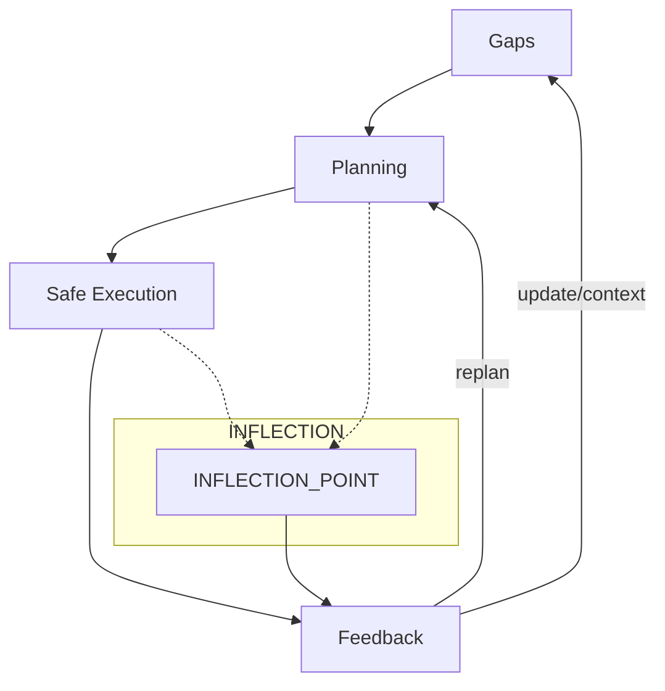
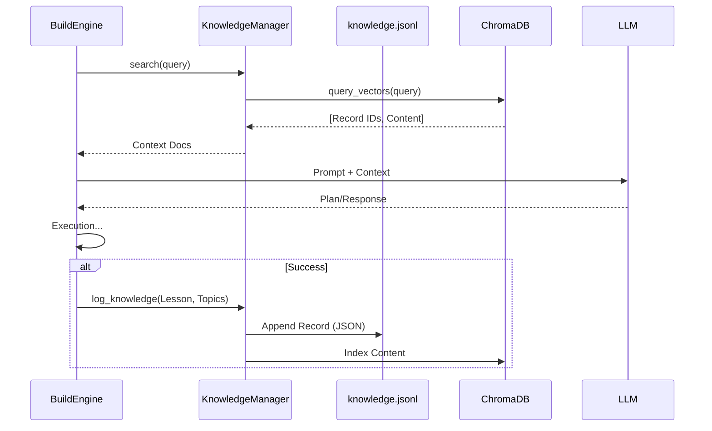

# Mithaly — Workflow (Layered Flow)

This document describes the operational workflow used by Mithaly: the layered transition order, what happens at `INFLECTION_POINT`, failure-handling patterns, and examples of transition records.

Principles
----------
- Layers run in order: `Gaps` → `Planning` → `Safe Execution` → `Feedback`.
- Transitions must be recorded with provenance and metrics (see `docs/context/schemas/layer_transition_schema.json`).
- `INFLECTION_POINT` is a guard: snapshot context and halt for review when a policy or safety check requires human or higher-authority approval.

Mermaid flowchart
------------------


Transition rules (concise)
-------------------------
- A task moves to the next layer only through an explicit transition record containing `from_layer`, `to_layer`, `reason`, `metrics`, `timestamp`, `actor`, `outcome`, `emergency`, and `approved_by` when applicable.
- Backward moves are disallowed except to review results of the immediately previous layer (e.g., `Execution` → `Planning` only to re-evaluate a failed execution plan).
- `Feedback` may initiate updates that effectively alter ordering (for example: updating knowledge that causes re-planning across multiple tasks).

INFLECTION_POINT behavior
-------------------------
- When a policy or probe raises a critical condition, the engine must:
  1. Write a snapshot of `current_context.json` into `docs/context/` with timestamped filename.
  2. Emit a transition record to `docs/context/` with `outcome: "blocked"` and `reason` describing the policy that triggered the stop.
  3. Halt automated progress until `approved_by` is set (human or automated approver) in a follow-up transition.

Failure scenarios (quick reference)
----------------------------------
- Execution failure: contain/stop, emit record, send to `Feedback` for analysis.
- Virtual test failure: reject plan, return to `Planning` with notes and metrics.
- Planning failure: iterate between theoretical and realistic planning up to two cycles; if unresolved, send to `Feedback` with explicit rejection reason.
- Emergency/unable-to-execute: mark task as `emergency=true` in transition record and escalate via the emergency file/process.

Examples (transition records)
-----------------------------
Example: successful planning → execution transition

```json
{
  "from_layer": "Planning",
  "to_layer": "Safe Execution",
  "reason": "Plan validated in sandbox",
  "metrics": {"sim_success_rate": 0.98},
  "timestamp": "2026-01-03T02:00:00Z",
  "actor": "ExecutionPlanner/v1",
  "outcome": "pending",
  "emergency": false,
  "approved_by": "policy_auto_v1",
  "provenance": "docs/analysis/plan_20260103.json"
}
```

Example: execution failure escalated to Feedback

```json
{
  "from_layer": "Safe Execution",
  "to_layer": "Feedback",
  "reason": "Resource conflict during deployment",
  "metrics": {"error_code": "DEPLOY_409", "retry_attempts": 1},
  "timestamp": "2026-01-03T02:15:22Z",
  "actor": "SafeExecutor/v1",
  "outcome": "failure",
  "emergency": false,
  "approved_by": "",
  "provenance": "logs/executor/2026-01-03/deploy.log"
}
```

References
----------
- Layered flow rules: `docs/rules/layered_flow.md`
- Transition schema: `docs/context/schemas/layer_transition_schema.json`
- INFLECTION_POINT and snapshot policy: see `docs/MITHALY_CONSTITUTION.md`

Last updated: 2026-01-03
# System Workflow & Data Flow

This document describes the operational flow of the Mithaly agent, specifically focusing on the **LangGraph Lifecycle** and the **Hybrid Knowledge System**.

## 1. Agent Lifecycle (LangGraph)

The agent operates as a directed graph. The nodes represent functional steps, and edges represent transitions.

```mermaid
graph TD
    START((Start)) --> Retrieve
    
    subgraph "Context Phase"
        Retrieve[Retrieve Context\n(Vector Search)] --> Gaps
        Gaps[Gap Analysis\n(Fast LLM)]
    end
    
    Gaps -- "Missing Info?" --> Retrieve
    Gaps -- "Ambiguous?" --> Clarify[Interactive Clarification]
    Gaps --> Policy
    Clarify --> Policy[Policy Enforcement\n(Constraints)]
    
    Policy -- "Inflection?" --> HALT((Halt))
    Policy --> Planning[Execution Planning\n(Smart LLM)]
    
    Planning --> Execution[Safe Execution\n(Standard LLM)]
    Execution --> Feedback[Feedback Loop]
    
    Feedback -- "Success" --> Memorize[Log Knowledge]
    Feedback --> END((End))
    
    style Retrieve fill:#e1f5fe,stroke:#01579b
    style Memorize fill:#e8f5e9,stroke:#1b5e20
```

## 2. Hybrid Knowledge Data Flow

The system uses a "Hybrid Memory" approach to ensure both auditability and fast retrieval.



## 3. Key Decision Points

| Node | Decision / Action | Routing |
| :--- | :--- | :--- |
| **Gaps** | Decides if inputs are sufficient. Can trigger a "Clarification Loop" or a "Retrieval Loop". | Uses `qwen2.5-coder:3b` (Fast) |
| **Policy** | Checks against `MITHALY_CONSTITUTION.md`. Triggers `Inflection` halts if boundaries are crossed. | Python Logic (Deterministic) |
| **Planning** | Generates the `plan` JSON. | Uses `deepseek-coder:16b` (Smart) |
| **Execution** | Executes the plan (simulated or real). | Uses `qwen2.5-coder:7b` (Standard) |
