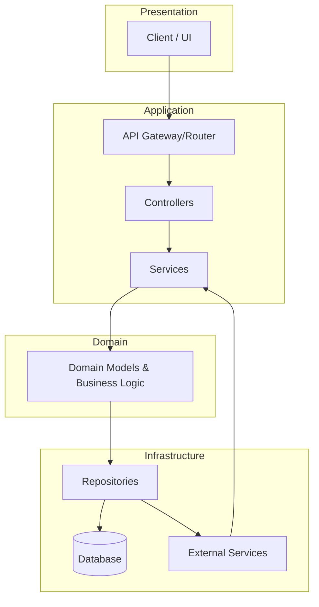

# Project Blueprint
*Primary source of project context and AI Agent guidance.*

## 🎯 Purpose

This file is the canonical project blueprint. It serves two main audiences:

1. **Developers and humans** — provides an engineering overview and single place to find the project's architecture and decisions.
2. **AI Agent** — supplies structured context so the agent can make accurate, safe, and relevant contributions without inferring details from scattered code and docs.

Think of it as the project's external brain or shared memory that everyone (including AI) uses to understand the big picture.

## 🏗️ 1. High-Level Design

### 1.1 System Overview
* **Type**: Web App / API Service / Library / Other.
* **Primary Goal**: [Short description of system purpose, e.g. "A platform for project management and team collaboration."]
* **Tech stack**:
  * **Backend**: [e.g. Python + Django / Node + Express / Java + Spring Boot]
  * **Frontend**: [React / Vue / Angular]
  * **Database**: [Postgres / MongoDB / MySQL]
  * **Deployment Architecture**: [Monolith / Microservices / Serverless]

### 1.2 Logical File / Folder Structure
The following logical diagram explains main layers and interactions (may differ from on-disk structure):

### 1.3 Design Principles
* Architectural pattern: [e.g., MVC / Clean Architecture / Microservices].
* Key principles:
  * Separation of concerns.
  * Dependency direction (e.g., Clean Architecture dependency rule).
  * Testable, maintainable code.

## 📡 2. Data Flow

### 2.1 Example: Create Order
Sequence shows typical flow for creating an order (UI -> API -> Service -> DB -> confirmation).

### 2.2 Data Stores and Integrations
* Primary DB: [Postgres 14, etc.]
* Cache: [Redis / Memcached]
* Object storage: [S3 / GCS]
* External integrations: [Stripe, SendGrid, Twilio]

## 🔗 3. Module Dependencies
Mapping of high-level service dependencies, e.g. `OrderService` depends on `PaymentService`, `InventoryService`, `NotificationService`.

## 🤖 4. AI Agent Guidelines
* Focus areas: `src/core/`, `src/services/`.
* Restricted areas: `src/api/routes/`, DB migrations — consult humans before large changes.
* Coding style: camelCase for functions, PascalCase for classes, UPPER_SNAKE_CASE for constants.
* Documentation: include docstrings/JSDoc for new functions.
* Testing: aim for 80% coverage; write tests for critical flows.

## ⚠️ 5. Known Issues and Roadmap
List current pain points, known bugs, and planned improvements (e.g., NotificationService refactor, Redis caching, message queue for background jobs).

---
*Last updated: 2025-12-23 by the project agent.*
# Project Blueprint (English)

This file is the canonical project context and AI Agent guidance document.

## Purpose

This document is the main project context guide. It serves two main audiences:

1. Developers and humans: provide a single engineering overview of the system.
2. The AI Agent: provide structured context so the agent can make precise, useful recommendations without inferring details from scattered code and docs.

Think of it as the project's external brain or shared memory that developers and the AI can consult for a concise, accurate system view.

## 1. High-Level Design

### 1.1 System Overview
- Type: Web app / API service / Library / other.
- Primary goal: [Briefly explain the problem this system solves, e.g. "A project management and team-collaboration platform."].
- Tech stack:
  - Backend: [Node.js with Express / Python with Django / Java with Spring Boot / ...].
  - Frontend: [React / Vue.js / Angular / ...].
  - Database: [PostgreSQL / MongoDB / MySQL / ...].
  - Architecture: [Monolith / Microservices / Serverless / ...].

### 1.2 Logical File Structure

(See mermaid diagram in Arabic blueprint for visualization.)

When analysing code, look for folders like `controllers/`, `services/`, and `models/` that implement this logical structure.

### 1.3 Design Principles
- Architectural pattern: [MVC / Clean Architecture / Microservices / ...].
- Principles: separation of concerns, one-way dependency rule (Clean Architecture), testable code.

## 2. Data Flow

### Example: Create Order
- UI -> API (OrderController) -> OrderService
- OrderService validates, checks inventory via InventoryService, initiates payment via PaymentService, saves Order, sends confirmation.

### Storage & Integrations
- Primary DB: e.g., PostgreSQL.
- Cache: Redis / Memcached.
- External storage: S3 / GCS.
- External services: Stripe, SendGrid, Twilio.

## 3. Control Flow & Dependencies

### Key service dependencies
- OrderService depends on PaymentService, InventoryService, NotificationService.
- AuthService depends on UserRepository, JWT utilities, EmailService.
- ReportGenerator depends on AnalyticsRepository and PDFExportService.

### Call sequence example
Inside `OrderService.createOrder()`:
1. validateOrderData()
2. inventoryService.checkAvailability()
3. paymentService.initiatePayment()
4. orderRepository.save()
5. notificationService.sendOrderConfirmation()

## 4. AI Agent Guidelines
- Focus areas: `src/core/`, `src/services/`.
- Restricted areas: consult before changing `src/api/routes/` or DB migrations.
- Document new functions with docstrings/JSDoc, follow existing code style, aim for tests (80% coverage goal).

## 5. Known Issues & Roadmap
- Performance issues in `UserService.getProfile` (fetches extra data).
- PATCH `/api/user` needs stricter authorization checks.
- Duplicate email validation logic across services — consider centralizing.

Roadmap highlights:
- Rework NotificationService to support multiple providers.
- Add Redis caching for slow queries.
- Decouple long-running tasks into a message queue.

---

Last updated: 2025-12-23
