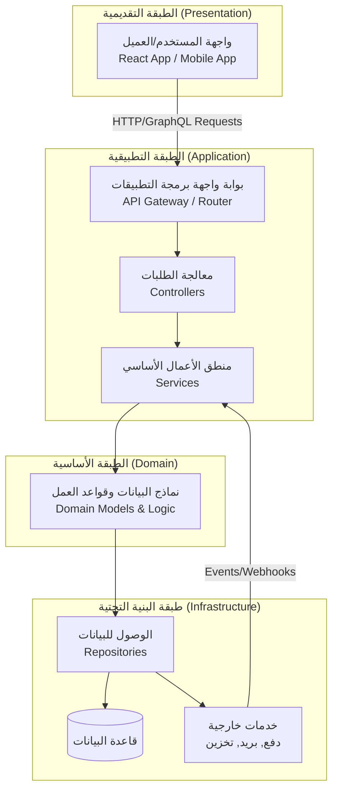
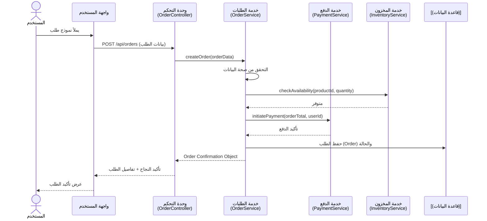

# Project Blueprint
*المصدر الرئيسي لسياق المشروع وتوجيه مساعد الذكاء الاصطناعي (AI Agent).* 

> Decision: FastAPI chosen as the canonical backend framework — documented 2025-12-24.


## 🎯 الغرض من هذا الملف

هذا الملف هو **دليل السياق الرئيسي** للمشروع. تم تصميمه خصيصًا لتحقيق هدفين:

1.  **للمطورين والبشر**: تقديم نظرة هندسية شاملة عن النظام في مكان واحد.
2.  **لمساعد الذكاء الاصطناعي (AI Agent)**: توفير السياق اللازم لفهم المشروع بشكل عميق، مما يمكنه من تقديم اقتراحات ومساهمات دقيقة ومفيدة، بدلاً من الاضطرار إلى استنتاج المعلومات من الكود والتوثيق المتناثر.

فكر فيه كـ **"عقل المشروع الخارجي"** أو **"ذاكرة المشروع الجماعية"** التي يستطيع الجميع، بما في ذلك الذكاء الاصطناعي، الرجوع إليها لفهم الصورة الكبيرة والدقيقة.

## 🏗️ 1. الهيكل العام والبنية (High-Level Design)

### 1.1. نظرة عامة على النظام
*   **النوع**: تطبيق ويب (Web App) / خدمة واجهة برمجة تطبيقات (API Service) / مكتبة (Library) / أخرى.
*   **الهدف الأساسي**: [اشرح بشكل موجز المشكلة التي يحلها هذا النظام، مثال: "منصة لإدارة المشاريع والتعاون بين الفرق."]
    *   **التقنيات الأساسية (Tech Stack)**:
    *   **Backend**: **Python — FastAPI** (المشروع الحالي يحتوي أمثلة FastAPI؛ قرّر الفريق توحيد المرجعية على FastAPI).
    *   **Frontend**: [React / Vue.js / Angular / ...].
    *   **قاعدة البيانات**: [PostgreSQL / MongoDB / MySQL / ...].
    *   **البنية**: [Monolith / Microservices / Serverless / ...].

### 1.2. هيكل الملفات والدلائل (الهيكل المنطقي)
يمثل الهيكل التالي التنظيم المنطقي للمشروع وكيفية تفاعل أجزائه الرئيسية. قد لا يتطابق تمامًا مع الهيكل الفعلي على القرص، لكنه يوضح العلاقات.



**ملاحظة للوكيل الذكي (AI Agent)**: عند تحليل الكود، ابحث عن تجسيد هذا الهيكل المنطقي في مجلدات الملفات (مثل `controllers/`, `services/`, `models/`).

### 1.3. مبادئ وهندسة التصميم
*   **نمط البنية (Architectural Pattern)**: [MVC / Clean Architecture / Microservices / ...].
*   **مبادئ أساسية**:
    *   [الفصل بين المسؤوليات (Separation of Concerns)].
    *   [اعتماد الطبقات باتجاه واحد (e.g., Dependency Rule in Clean Arch)].
    *   [كتابة كود قابل للاختبار (Testable)].

## 📡 2. تدفق البيانات (Data Flow)

### 2.1. مخطط تدفق البيانات الرئيسي (مستوى عالٍ)
يصف هذا القسم مسار البيانات عبر النظام لسيناريوهات الاستخدام الرئيسية.

**سيناريو: "إنشاء طلب جديد (Create Order)"**


### 2.2. مستودعات البيانات والتكاملات
*   **قاعدة البيانات الأساسية**: [اسم ونوعها، مثال: PostgreSQL 14]. الغرض الأساسي: [تخزين بيانات المستخدمين، المعاملات، ...].
*   **ذاكرة التخزين المؤقت (Cache)**: [Redis / Memcached / ...]. الغرض: [تخزين نتائج الاستعلامات المتكررة، جلسات المستخدمين].
*   **التخزين الخارجي**: [Amazon S3 / Google Cloud Storage]. الغرض: [ملفات المستخدمين، الصور].
*   **التكاملات الخارجية (APIs)**: [Stripe للدفع، SendGrid للبريد، Twilio للرسائل النصية]. الوثائق في: [رابط أو مسار ملف التوثيق الداخلي].

## 🔗 3. ترابط الوظائف والتبعيات (Control Flow / Dependency Graph)

### 3.1. تبعيات الوحدات/الخدمات الرئيسية
هذا القسم يوضح العلاقات "من يعتمد على من" على مستوى الخدمات أو الوحدات الكبيرة.

| الوحدة/الخدمة | تعتمد على | الغرض من التبعية |
| :--- | :--- | :--- |
| **`OrderService`** | `PaymentService`, `InventoryService`, `NotificationService` | معالجة الطلب بالكامل (دفع، تحقق من المخزون، إشعار). |
| **`AuthService`** | `UserRepository`, `JWT Utility`, `EmailService` | مصادقة المستخدم، إدارة الجلسات، استعادة كلمة المرور. |
| **`ReportGenerator`** | `AnalyticsRepository`, `PDFExportService` | جمع البيانات وعمل تقارير بصيغة PDF. |

### 3.2. التبعيات على مستوى الدوال (نماذج)
للحالات الحرجة، حدد سلسلة الاستدعاءات داخل إحدى العمليات.
```javascript
// مثال: داخل OrderService.createOrder()
1. validateOrderData()          // ← دالة محلية
2. this.inventoryService.checkAvailability() // ← تبعية لخدمة أخرى
3. this.paymentService.initiatePayment()     // ← تبعية لخدمة أخرى
4. this.orderRepository.save()  // ← تبعية لوحدة البيانات
5. this.notificationService.sendOrderConfirmation() // ← تبعية لخدمة أخرى
```

**ملاحظة للوكيل الذكي**: عند اقتراح أي تغيير على `OrderService`، تأكد من فهم تأثير هذا التغيير على جميع هذه التبعيات.

## 🤖 4. تعليمات خاصة بالوكيل الذكي (AI Agent Guidelines)

### 4.1. نطاق العمل والقيود
*   **مناطق التركيز (Focus Areas)**: أنت مخول بشكل أساسي للمساعدة في تطوير/تحسين الكود داخل: [`src/core/`, `src/services/`].
*   **مناطق المقيدة (Restricted Areas)**: استشر المطور البشري قبل اقتراح تغييرات جذرية على: [`src/api/routes/`, بنية قاعدة البيانات في `/migrations`].
*   **العمليات الحرجة**: أي اقتراح يتعلق بـ **تدفق الدفع** أو **مصادقة المستخدم** يجب أن يكون محافظًا ويأتي مع اقتراح لاختبارات شاملة.

### 4.2. نمط الكتابة والأفضل Practices المطلوبة
*   **التوثيق (Documentation)**: عند كتابة دوال جديدة، أضف تعليقًا (JSDoc/Python Docstring) يصف المعاملات (Parameters)، القيمة المعادة (Return value)، والاستثناءات المحتملة (Exceptions).
*   **نمط الكود (Coding Style)**: اتبع النمط الموجود. بشكل عام: [أسماء الدوال بـ camelCase، الأصناف بـ PascalCase، الثوابت بـ UPPER_SNAKE_CASE].
*   **الاختبارات (Testing)**: شجع على كتابة اختبارات. النسبة المستهدفة للتغطية (Code Coverage) لهذا المشروع هي **80% على الأقل**.

### 4.3. كيفية التعامل مع الغموض
إذا كان السياق غير واضح من هذا الملف أو الكود:
1.  **اسأل أولاً**: اطلب توضيحًا حول [المتطلبات التجارية، سبب وجود كود معقد، نية تصميم معين].
2.  **اقترح خيارات**: قدم حلين أو ثلاثة مع إيجابيات وسلبيات كل منها.
3.  **كن محافظًا مع الكود القديم (Legacy Code)**: إذا لم تفهمه تمامًا، اقترح تحسينات تدريجية (Refactoring) بدلاً من إعادة كتابة كاملة.

## ⚠️ 5. الثغرات المعروفة والتحسينات المخطط لها

### 5.1. نقاط الضعف/التحسين الحالية
| المشكلة | الموقع المحتمل | التأثير | الأولوية |
| :--- | :--- | :--- | :--- |
| **أداء استعلام المستخدم**: استعلام `UserService.getProfile` يجلب بيانات غير ضرورية. | `src/services/userService` (Python/FastAPI) | أوقات استجابة أبطأ لصفحة الملف الشخصي. | عالية |
| **أمان نقطة النهاية**: تحتاج نقطة `PATCH /api/user` إلى تحقق أدق من الصلاحيات (Authorization). | **ملاحظة**: تم العثور على حماية في المثال التعليمي `project_management/scripts/examples/secure_user_patch/app.py`، ولكن لم يُعثر على تطبيق Node.js/Express إنتاجي؛ راجع `CONTEXT_LOG` لتفاصيل البحث. | ثغرة أمنية محتملة. | حرجة |
| **تكرار الكود**: منطق التحقق من صحة البريد الإلكتروني يتكرر في خدمات متعددة. | `authService`, `userService`, `newsletterService` | صعوبة الصيانة. | متوسطة |

## 📜 التاريخ المعماري

- **2023-10-27**: المخطط الأصلي وصف تطبيقًا مبنيًا على Node.js/Express.
- **2025-12-22**: نقل ملفات سياق وملاحظات وأمثلة FastAPI إلى المستودع.
- **2025-12-23**: اكتشاف فجوة بين المخطط والرمز المُنفّذ — لم يُعثر على تطبيق Node.js/Express في الشجرة.
- **2025-12-24**: قرار توحيد المرجعية على **FastAPI** وتوثيق الحقيقة في `project_management/agents/CONTEXT_LOG.jsonl`.

**ملاحظة لمديري المشروع:** إذا كنتم ترغبون في إعادة بناء تطبيق Node.js مطابقًا للمخطط الأصلي، اقترح فتح مهمة منفصلة (`SEC-001`) مع خطة استعادة/بناء. بدلاً من ذلك، يمكننا تعديل المخطط ليعكس حالة FastAPI الحالية.

### 5.2. خارطة الطريق للتحسينات (Roadmap)
- **[قيد التطوير Q3]** إعادة هيكلة `NotificationService` لدعم عدة موفّرين (مثل SendGrid، Amazon SES) بسهولة.
- **[مخطط لـ Q4]** إضافة نظام تخزين مؤقت (Caching Layer) باستخدام Redis لنتائج الاستعلامات البطيئة والمتكررة.
- **[مستقبلي]** فك ارتباط (Decouple) الوحدات باستخدام نظام رسائل (Message Queue) مثل RabbitMQ لعمليات الخلفية الطويلة.

---
*تم تحديث هذا الملف آخر مرة في: 2023-10-27 بواسطة: [اسم المطور أو الفريق].*
